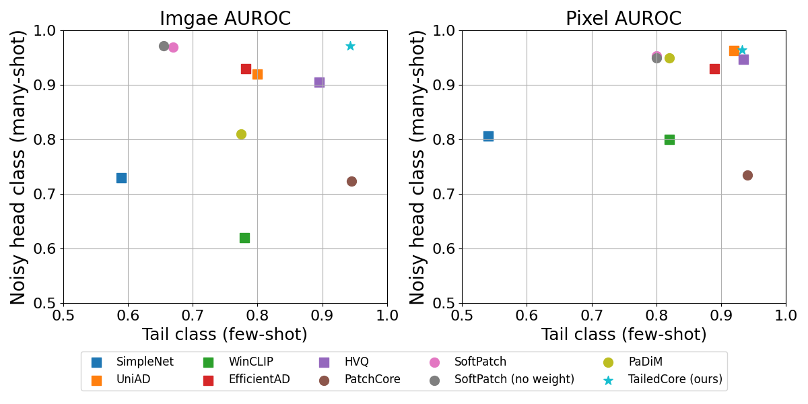
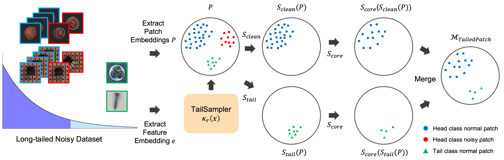
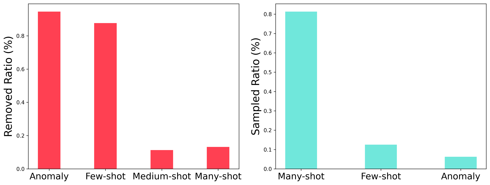
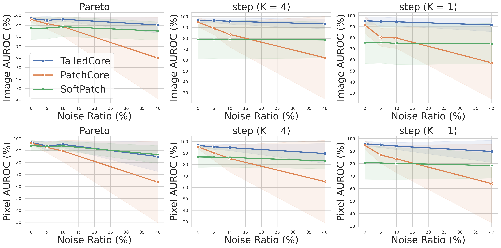

## 📢 **News and Updates**

- ✅ Mar 10, 2025. TailedCore **code** released.

<div align="center">

# [CVPR 2025] TailedCore : Few-Shot Sampling for Unsupervised Long-Tail Noisy Anomaly Detection

### This is the official repository for [TailedCore](https://google.com) (CVPR 2025).

Yoon Gyo Jung*, Jaewoo Park*, Jaeho Yoon*, Kuan-Chuan Peng,

Wonchul Kim, Andrew Beng Jin Teoh, Octavia Camps

*: Equal Contribution

[Project Page](https://jungyg.github.io/TailedCore_site)

</div>

<div align="center">


</div>

TL;DR: We suggest a novel practical challenging anomaly detection task, noisy long-tailed anomaly detection where tail classes are unknown and head classes are contaminated. We suggest TailSampler, which first tail classes with class size estimation and denoise head classes seprately.

<div align="center">
  
</div>

**Performance comparison with baselines**

<div align="center">
  
</div>

**Pipeine of TailedCore**

<div align="center">
  
</div>

**Noise discriminative models remove tail classes(left) while greedy sampling samples both tail and noise**

<div align="center">
  
</div>

**Ablation with noise ratio comparing with baselines**

## **Getting Started**

### 🪒 *Installation*

Install the required packages with the command below

bash install_packages.sh

### 💾 *Dataset Preparation*

## Convert ViSA to MVTecAD format

The following code converts ViSA dataset to MVTecAD format. Specify the source path (where original ViSA datsaet is located), and target path (where to save the converted ViSA dataset) and the `split_csv/1cls.csv` directory in the code.

```
python convert_visa_to_mvtec_format.py

```

## Prepare noisy long-tailed dataset

The following code generates a noisy long-tailed dataset of MVTecAD and converted ViSA(converting visa like MVTecAD dataset format is required). First, make a directory "./data" in the repository and generate a symlink or move the dataset of MVTecAD and VisA into `./data` with

```
mkdir ./data
ln -s {MVTecAD_ABS_DIR} {PROJECT_ABS_DIR}/data/mvtec
ln -s {VisA_ABS_DIR} {PROJECT_ABS_DIR}/data/visa
```

Next, specify the arguments the arguments to acquire the noisy long-tailed dataset. If `random_tail` is False, `tail_classes` should be specified with the list of tail classes and the number of `tail_classes` should be equal to int(num_classes * `tail_ratio`). Below are a few examples

```
python generate_noisy_tailed_dataset.py --dataset mvtec --tail_type pareto --random_tail True
python generate_noisy_tailed_dataset.py --dataset mvtec --tail_type k4 --random_tail True

python generate_noisy_tailed_dataset.py --dataset mvtec --tail_type k4 --random_tail False --tail_classes cable capsule wood zipper bottle transistor grid screw hazelnut
python generate_noisy_tailed_dataset.py --dataset mvtec --tail_type pareto --random_tail False --tail_classes cable capsule wood zipper bottle transistor grid screw hazelnut

```

We have included the dataset configs for our experiments in `./data_configs`. To reproduce, run codes

```
bash generate_dataset.sh
```

## Train/test

After generating the noisy long-tailed dataset, run the code to train model. The configuration file for training or testing should be saved in `./configs` directory.

```
python main.py --dataset --mvtec --noisy_lt_dataset paretno_nr0.1_seed42 --config tailedcore_mvtec
```

## Code Structure

Refer the files
[`coreset_model`](./src/coreset_model.py) for the code of each models
[`sampler`](./src/sampler.py) for the code of each samplers

which are the core codes of our method.

## **Citations**

**The following is a BibTeX reference:**

```latex

```

## Acknowledgement

The code is based on the repository of [PatchCore](https://github.com/amazon-science/patchcore-inspection)
